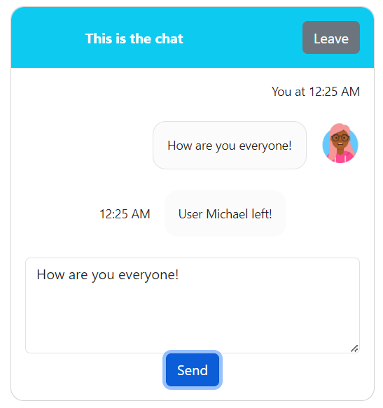

# Chat Room Component
This is a simple real-time chat implementation using React.jsx and Node.js. The Chat client is capable of receiving 
server-side notifications regarding newly connected users, users that left the chat room and received messages from
other chat participants using WebSockets.

# Example
First, the user is presented to the page that asks the user to Join the chat.


After joining the chat, the other participants will get a notification that informs them a user has connected.


When the user leaves the chat, the participants will get a notification thath informs them a user has left.


## Usage
```
function App() {
return (
<Chat serverUrl={"ws://localhost:8080"}/>
);
}
```

The Chat component expects only one property ```serverUrl``` that represents a WebSocket endpoint that
implements the flows described next.

## Communication Flows
When the user joins the chat room, a WebSocket connection is opened at the specified ```serverUrl```.
If the WebSocket handshake is successful, the client sends the username of the connected user so that
the server will notify the other participants that a user entered a chat. When the user sends a message,
the web client will send the message on the opened connection and will update the component only
after the server responds with another message that includes a timestamp. When the user leaves,
the WebSocket connection is closed at client side and the server notifies the other participants that
the user left.

## JSON Messages Used
### Client to server
### User joins chat (after handshake)
```
{
    "type": "JOIN",
    "username": "Michael"
}
```
The username used in the "JOIN" message will be stored in the associated WebSocket session
on server side.

### User sends message to chat
```
{
    "text": "Hello!"
}
```

### Server to client
### Server responds to client when the user sends a message
```
{
    "sender": "Michael",
    "sendByCrtUser": "true",
    timestamp: <date_in_iso_format>,
    "text": "Hello!"
}
```
### Server notifies that a user joined
```
{
    "sender": "Michael",
    "sendByCurrentUser": false,
    "timestamp": <date_in_iso_format>
    "type": "USER_JOINED"
}
```

### Server notifies that a user left (on close on server side)
```
{
    "sender": "Michael",
    "sendByCurrentUser": false,
    "timestamp": <date_in_iso_format>
    "type": "USER_LEFT"
}
```

## Chat Component implementation
On the client side, the chat room component is implemented using React Functional Components and
React Hooks. To decouple the communication protocol from the view details,
a React Provider component was used for managing the state of the Chat Component.