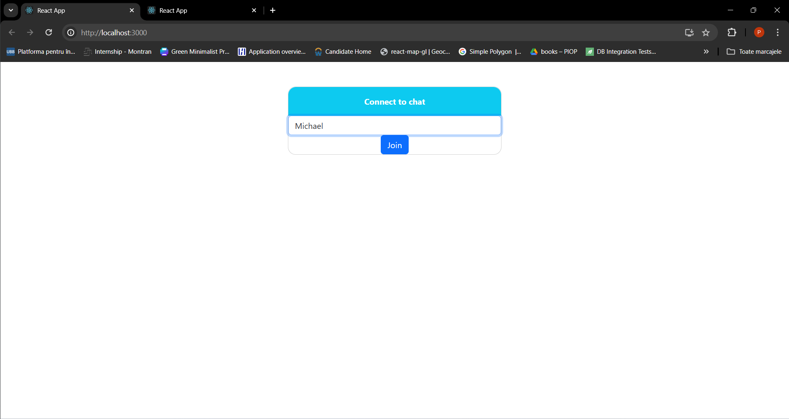

# Chat Room Component
This is a simple real-time chat implementation using React.jsx and Node.js. The Chat client is capable of receiving 
server-side notifications regarding newly connected users, users that left the chat room and received messages from
other chat participants using WebSockets.

# Example
[](https://www.google.com/)

## Usage
```
function App() {
return (
<Chat serverUrl={"ws://localhost:8080"}/>
);
}
```

The Chat component expects only one property ```serverUrl``` that represents a WebSocket endpoint that
implements the flows described next.

## Communication from client to server:

